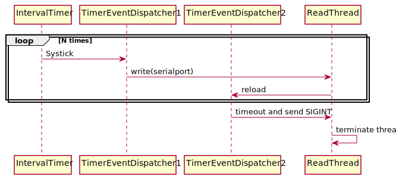

# Test App for Studying Signals and Serialport Blocking I/O Operations
## Objective
I felt difficulties in writing multithreading communication program more in
Linux than in Windows. Especially the following two categories of APIs are
less intuitive than those of Windows.
1) Low level file I/O like open, close, read, write; Similar to Windows CreateFile, ReadFile, etc.
2) Signal APIs like sigaction and related timer APIs; Similar to Windows event and TimerQueueTimer
Therefore I tried to design a small test program utilizing following components,
1) Interval timer,
2) Timer event dispatcher, and
3) Low level blocking file I/O for serialports.

## App Overview
The sequence diagram is shown below.  
  
Participants in the diagram are:
* IntervalTimer : Linux system timer set by setitimer(ITIMER_REAL,) to generate SIGALRM at each 10 ms.
* TimerEventDispatcher1 : A down counter and a callback function; send a string at each 300 ms.
* TimerEventDispatcher2 : Down counter and callback function; send SIGINT to the read thread.
* ReadThread : repeatedly call read() function.

## Intereval Timer

## Event Dispatcher

## Serialport I/O

## Sending Signal to A Thread
